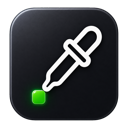

# 🎨 Color Picker Ultimate Edition

**The ultimate color picker for Chrome.**  
Pick colors from any webpage, convert between formats, and build your own color palette. Fast, elegant, and powerful.



## ✨ Features

- **🎯 Eyedropper Tool**: Click anywhere on any webpage to pick a color instantly.
- **🔄 Format Conversion**: Automatically converts between HEX, RGB, and HSL.
- **📋 One-Click Copy**: Click any format to copy it to your clipboard.
- **📚 Color History**: Keeps track of your recently picked colors.
- **🎨 Color Palette Builder**: Save your favorite colors for easy access.
- **🌓 Smart UI Theming**:
  - **System**: Automatically matches your OS Dark/Light mode.
  - **Manual**: Light, Dark, Midnight, Latte, Forest, Neon, Rose, or Custom themes.
- **🌍 Multi-Language Support**: English (Default), Français, Español, Deutsch, Português, 简体中文, 日本語, Русский.
- **⚡️ Lightweight**: No bloat, instant results.

## 🚀 Installation

1. Clone this repository:
   ```bash
   git clone git@github.com:nicodeiro/Color-Picker-Ultimate-Edition.git
   ```
2. Open Chrome and navigate to `chrome://extensions/`.
3. Enable **Developer Mode** (toggle in top-right).
4. Click **Load unpacked**.
5. Select the extension directory.

## 🛠 Usage

1. Click the extension icon in your toolbar.
2. Click the **eyedropper** button to activate color picking mode.
3. Click anywhere on the webpage to pick a color.
4. The color appears in HEX, RGB, and HSL formats.
5. Click any format to copy it to your clipboard.

## 🎨 Personalization

Go to **Settings** (⚙️ icon) in the popup to:
- Change the Language.
- Switch UI Themes (System, Light, Dark, and 5+ premium themes).
- Create a Custom Theme with your own colors.

## ❤️ Support

If you like this tool, consider supporting the development!  
[Buy me a coffee ☕️](https://buymeacoffee.com/bitek)

---
*Created with ❤️ by [Bitek](https://bitek.fr)*
